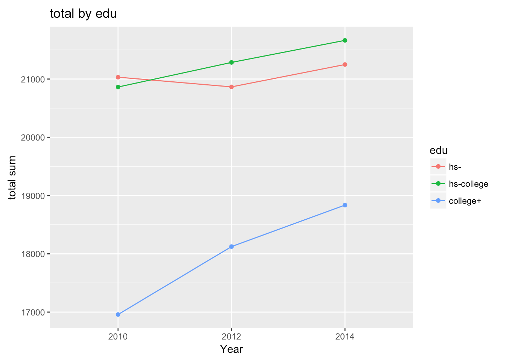
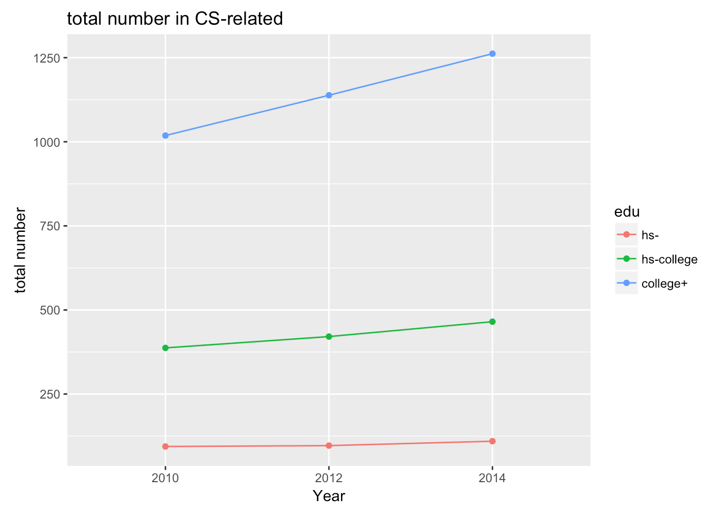
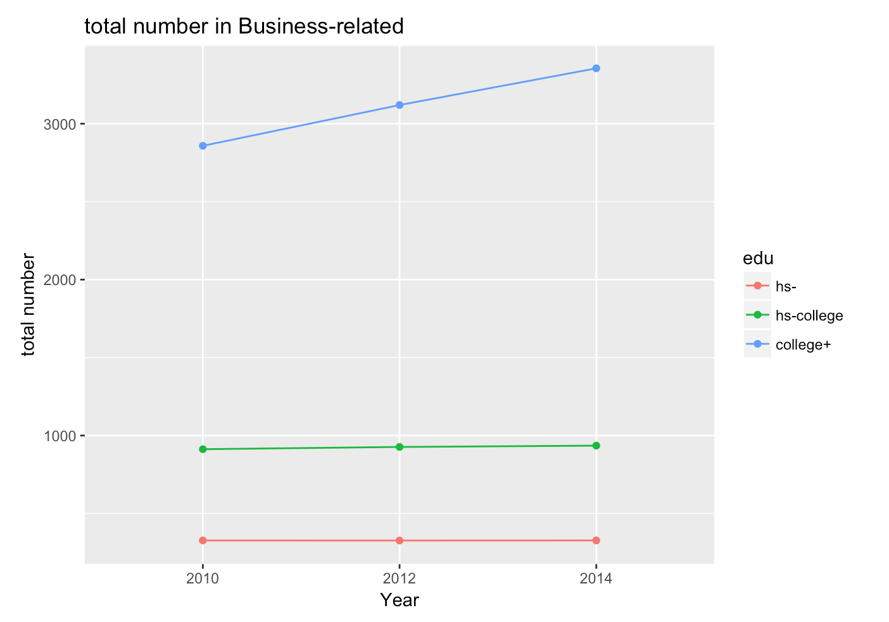
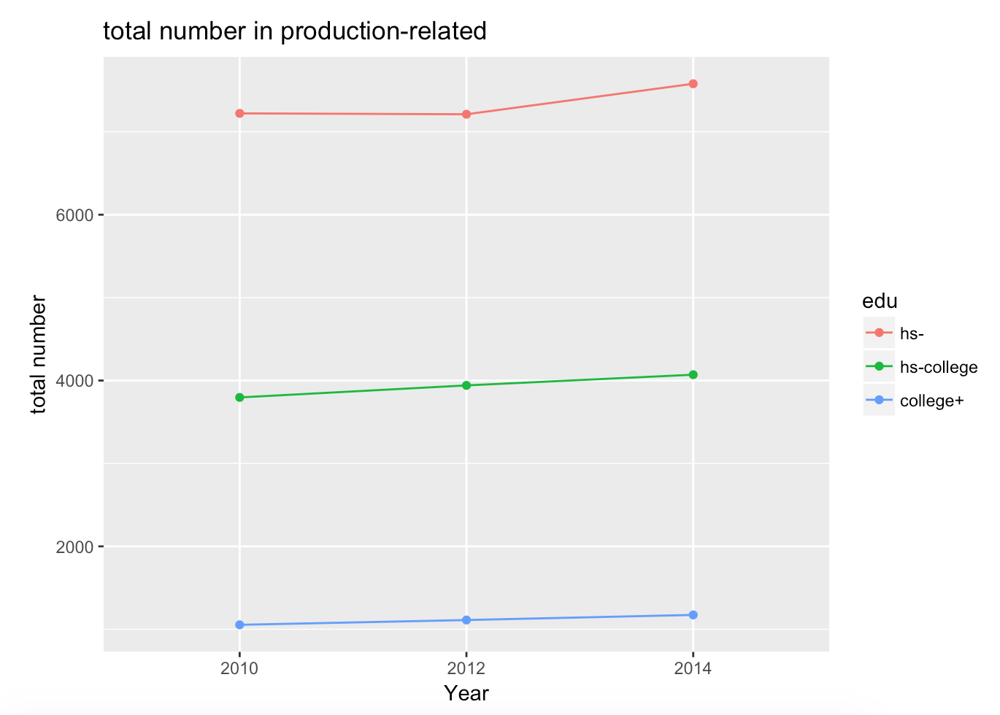
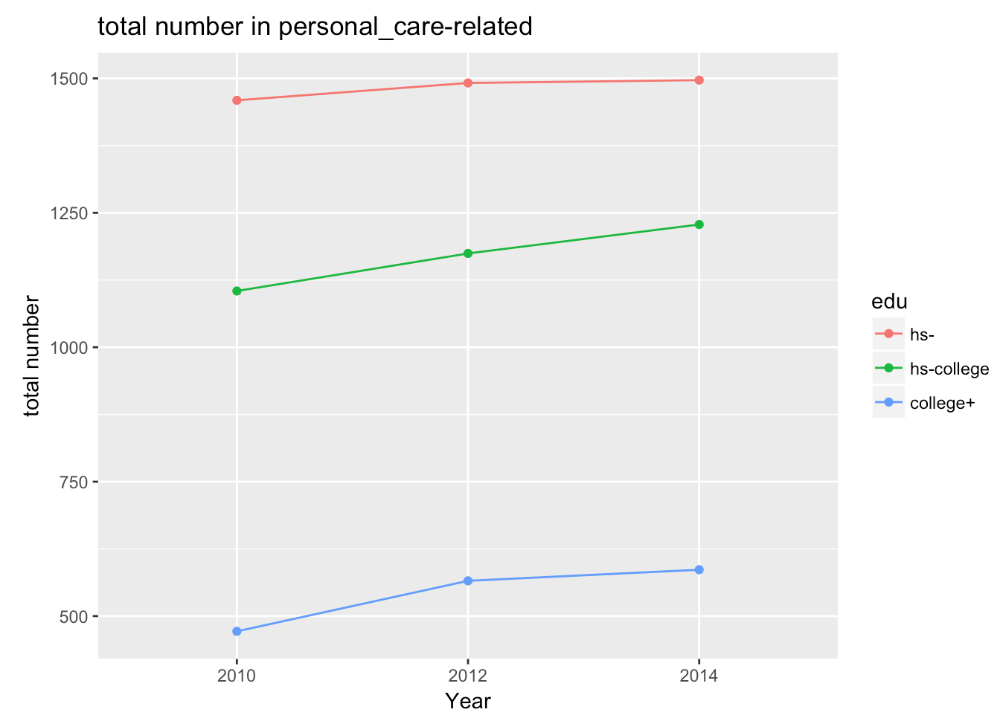

## Update 2 Nov 10

### Shangjun (Jenny) Jiang

This update contains three parts
- What I have done
	- A. Data Cleaning
	- B. Joining multiple dataset
	- C. Data plotting (linking with other datasets)
- What I intend to do
	- A. Visualize existing plots using d3.js
	- B. Do more analysis on other dataset (salary, demographics, industry)
	- C. Other existing dataset
- Problems, obstacles

### I: What I have done

##### A. Data Cleaning

I first loaded the dataset [`educational attainment for workers 25 years and older by detailed occupation`]((https://www.bls.gov/emp/ep_table_111.htm)) for 2010-11; 2012-13; 2014-15. This dataset details the PERCENTAGE of people in different occupations and education level.
I created a different code which only contains the first six digits. The reason I did that is for redundancy. Some rows contain the same information. The only difference is the 7th digit of the codes. 

Then I loaded dataset [Occupation data](https://www.bls.gov/cps/demographics.htm), 2011, 2012, 2013, 2014, 2015. Noted on the website: "occupation data beginning with January 2011 are not strictly comparable with earlier years", I decided to use 2011 detailed occupation to represent 2010-11. I will take an average of 2012-13, 2014-15 to get the total number.

The reason behind using these two datasets is that I can get total number of people in occupation by education. The existing dataset only contains percentage, which will be difficult for over-time comparison.

#####B. Joining multiple Dataset

After getting these two datasets, I joined these two datasets together. I joined them by their employment names, omit the NA values. Then, I left with 230 observations.

I added year for every dataset. I used "2010" for 2010-11, "2012" for 2012-13, "2014" for 2014-15.
Then I joined these three datasets together. Now, the dataset is a wide format as every education is an individual column. I used `melt` to convert the wide format to long format. I give them two column names: `degrees` and `number`. 

Another step I did is to aggregate the education level. I divided them into three categories and name this variable `edu`:
1. `college +` : bachelor, master, doctor.professional
2. `hs-college`: some.college..no.degree, associate
3. `hs-`: high.school, less.hs

In this way, it will be a lot easier to do comparison and plotting.

After all these steps, I left with 9 variables.
employment;  Total;   median; code; year; code2; degrees;   number; edu
I still included the original `code` because I may use it later to join with other dataset. I also included the median age for every occupation in case I use it for the future.

 

##### C. Data Plotting (Linking with other datasets)

I first looked at the overall trend of three time points.
Interestingly, There is a huge increase for college degrees. HS-College is also increasing, with HS- a slight increase. 

Then I used this [Occupation Profiles](https://www.bls.gov/oes/current/oes_stru.htm) to aggregate the occupation data. Therefore, instead of looking at detailed occupation.

For some occupations, such as CS/Business jobs, there is an increasing demand for college degree.

However, for some others, the increase/decrease is not very obvious. For instance, the personal-care and production still stays the same. 

### II: What I intend to do

###### A. Visualize existing plots using d3.js 

I used R to clean the data and did some EDA. Now, I want to use d3.js so users can select what industry they want to take a look at. Then, they can hover over and see what specific numbers they are.

###### B. Do more analysis on other dataset (salary, demographics, industry)

I think it will be super interesting to take a look at the salary dataset and demographics

[Computer and Mathematical Occupations](https://www.bls.gov/oes/current/oes150000.htm)
This has 
- national estimates for this occupation. 
- industry profile for this occupation.
- Geographic profile for this occupation.

###### C. Other existing dataset

I found [similar dataset on this page](https://www.bls.gov/emp/ep_education_training_system.htm) 
- Earnings and unemployment rates by educational attainment
- Educational attainment for workers 25 years and older by detailed occupation
- Education and training assignments by detailed occupation, 2014
- Employment, wages, and projected change in employment by typical entry-level education

For these datasets, I could look at the projection and see what BLS think of the future, particularly for CS/Business related roles. Will the industry become education-biased? Does that mean everyone has to earn a college degree? 

### III: Problems, obstacles 

At first, I had problems with the time comparison. However, with Peter's help, I was able to find the total number dataset and joining these two datasets together.

As I get the total number, it is a lot easier to do comparison. I'm not sure how much else I can do with my dataset. I didn't do a lot of sophisticated statistical analysis.

My current story is that industry is becoming education-biased, particularly for the high-paying jobs (which needs to be supported by other datasets)

For the next step, I am a bit unclear which direction I should go. I should definitely go with the salary dataset. 
However, should I talk about unemployment, projection, or should I focus on the demographics information?

Additionally, I'm not sure how much d3.js will take me to create. I have limited JavaScript skills but am very interested in learning/doing that.

